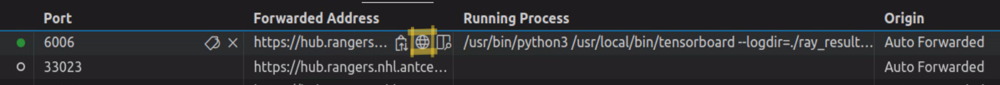

# Lab 8: Deep Reinforcement Learning

### ACEHUB Env Resources:
```
CPU: 10
RAM: 32 GB
GPU: None
Advanced Options:
    Shared Memory: 12 GB
```

*This lab has a new requirements.txt file (in .devcontainer folder) that includes libraries not installed in previous labs. You may use a new container image for your acehub environment to have these preinstalled:* 
```
git.antcenter.net:4567/nyielding/acehub-tensorflow-image:1.4-rl 
```
It is highly recommended to use the prebuilt container image since it the requirements take several minutes to install.

*You may build/use this container on your own machine by using "reopen in devcontainer" from the repo in VSCode. There are comments in the `./.devcontainer/devcontainer.json` file* 

This lab is unique from the rest of the labs in the course. Instead of supervised learning, the subject is reinforcement learning. Come to this lab with a fresh mindset, but remember the knowledge you've gained about ANNs, learning, metrics, etc.  

This lab also differs in layout from the previous labs. All but the most simple reinforcement learning problems will require more than a single script to build an experiment. Part of the learning experience is to practice studying, understanding, and working with a larger repository of multiple files, including some you may not have written. Your understanding of object-oriented programming will be tested just a little more than before. 

But don't fret! There is only a few lines of code to actually type, and nearly every snippet of code you need is already written somewhere else in the repo.

## Flappy Bird - To Flap, or Not to Flap?
The goal of this lab is to train an RL policy that plays the classic mobile game "Flappy Bird" as implemented in python as a pygame. Flappy Bird already has a training environment built in Gymnasium from the package flappy_bird_gymnasium. Your task will be to extend and modify this gymnasium both by creating a child class of it, and also through custom callback functions passed to RLlib. RLlib is the reinforcement learning library that comes with Ray (that you recall from the Ray Tune portion of Lab 5). It is very much a heavy, powerful, do anything library that can be intimidating... but lucky for you I have already filled in 95% of the coding.

Note: you could actually play the game via this library if you install it on a local machine, but it would be easier to just play via flappybird.net. Can you do better than your RL policy?

## Lab Files:
*You should read all files in this repository to understand how they interact in order to complete the code.*

To complete the assignment, you will have to add or edit code in the following files:

`./custom_flappy_bird/gym_env/custom_flappy_env.py`: 

In order to change the gym environment, we will make a child class of it to inherit the code by calling a method via super().a_method_such_as_step() and then mutating the return before returning it in our method. This is the simplest way to change something, and having the code laid out this way will help you understand the flow of data in a Gymnasium.

1. The task here is to determine when the episode is finished (because the bird crashed) and color the bird's hitbox red for that last step. *note that this is **not** the `self.bird_color` which loads a sprite image of red or yellow, value that is passed to the private _renderer that colors the square hitbox of the bird*. There is a method in the parent class to accomplish this. 

2. Don't forget to set the color back to `None` in the reset() method, or else the bird will be red on the following episodes...

`./custom_flappy_bird/utils/rllib_callbacks.py`:

Another powerful way to interact with the training loop is to create callbacks. Most libraries allow for callbacks and have slightly different formats for them. I have already written most of the callbacks, including the complex one that records movies for when you evaluate your policy. You have to 

3.   Finish writing `FlapActionMetricCallback`. The purpose of this callback is to read the action that the agent took each step of the episode and store it. At the end of the episode, store the ratio of 'flaps' as a custom metric. This should be like a "percentage of steps flapped" or more precisely `steps_flapped/total_steps` $\frac{Flap_{steps}}{Total_{steps}}$ in the episode.

4. Write `CustomScoreCallback`. The purpose of this callback is to store the score at the end of the episode as a custom metric. The score is already calculated by the environment and stored in the episode `info` for you as part of the parent gym.

`./custom_flappy_bird/train.py`: 

Finish the script to build an RL algorithm from a config object and pass it to the tune.Tuner for training. Pay attention to where your checkpoints are (`ray_results` folder) for the submission. Do NOT turn on the replay callback for training unless it is to help you debug... this will greatly slow your training down. It is better to get replays from evaluations.

5. Train your bird! Expect it to take roughly 45 minutes per 500 iterations trained. This can vary greatly depending on what parameters you change and what algorithm you use. 500 iterations is likely the bare minimum to get through some pipes, 1000 iterations could do pretty well if tuned. Beyond that is up to your time and perfectionism...

6. Once you have your trained policy's best checkpoint folder, copy this folder to `./submission/YOUR-LAST-NAME`. Only copy ONE checkpoint, not the whole results folder. A checkpoint is a **folder**, not an individual *file*, and looks roughly like: 
```
/root/eeng645-rllab/ray_results/Lab8FlappyBirdPPO/PPO_flappybird_bb575_00000_0_2024-02-21_03-24-33/checkpoint_000004
```
The directory of this checkpoint should contain these files:
```
checkpoint_000004/
|-- policies/
|   |-- default_policy/
|   |   |-- policy_state.pkl
|   |   |-- rllib_checkpoint.json
|
|-- algorithm_state.pkl
|-- rllib_checkpoint.json
```

`./custom_flappy_bird/eval.py`: 

Once you have your checkpoint, put it in the `checkpoint` variable at the top of this file and run it to see how it does! By default it will create .mp4 videos of the running new-best episode. You may also invoke this from the terminal in the workspace directory like `python eval.py *checkpoint*`. Type `python eval.py -h` for more info. Keep in mind that to copy or paste from the terminal you should use `ctr+shift+c` and `ctr+shift+v` respectively instead of the normal `ctr+c`, `ctr+v`. 

7. Take your best .mp4 video file and add it to the `./submission/YOUR-LAST-NAME` folder.

### Write a comment on the learning process:
Since you wrote custom metrics, you should actually look at them! Launch Tensorboard by opening a new terminal (it can be while the training is ongoing in another terminal) with the command:
```
tensorboard --logdir=/path/to/ray_results/
```
Once you execute this, VSCode will automatically forward the port (default 6006) and you may click the popup to open Tensorboard in a new browser tab. If you missed the popup... then click on the `PORTS` tab near the Terminal and click the globe button next to the port like so:



The page does not refresh automatically, you must press the refresh button in the top right. I do NOT recommend the auto-refresh feature, as it can mess the log files up sometimes. So do not spam the refresh button too much either. You can use the search bars to look at various graphs. I recommend looking at searches of `reward` and the custom metrics you made--`score`, and `flap_ratio`.

8. Based on what you see in Tensorboard answer the question(s) in `./submission/YOUR-LAST-NAME/SUBMISSION.md`

## Submission Folder
So to reiterate, when you push your code you will need to have written any comments in SUBMISSION.md and moved a checkpoint folder and .mp4 file into the `./submission/YOUR-LAST-NAME` folder, then add/commit/push this folder with your code. When submitting, the folder should look like this:

```
submission/
|-- YOUR-LAST-NAME/
|   |-- 9000.01_reward_20240303-235959_FLAPPY.mp4
|   |
|   |-- checkpoint_000004/
|   |   |-- policies/
|   |   |   |-- default_policy/
|   |   |   |   |-- policy_state.pkl
|   |   |   |   |-- rllib_checkpoint.json
|   |   |
|   |   |-- algorithm_state.pkl
|   |   |-- rllib_checkpoint.json
|   |
|   |-- SUBMISSION.md
```
### DON'T FORGET TO CHANGE `YOUR-LAST-NAME` TO YOUR ACTUAL NAME